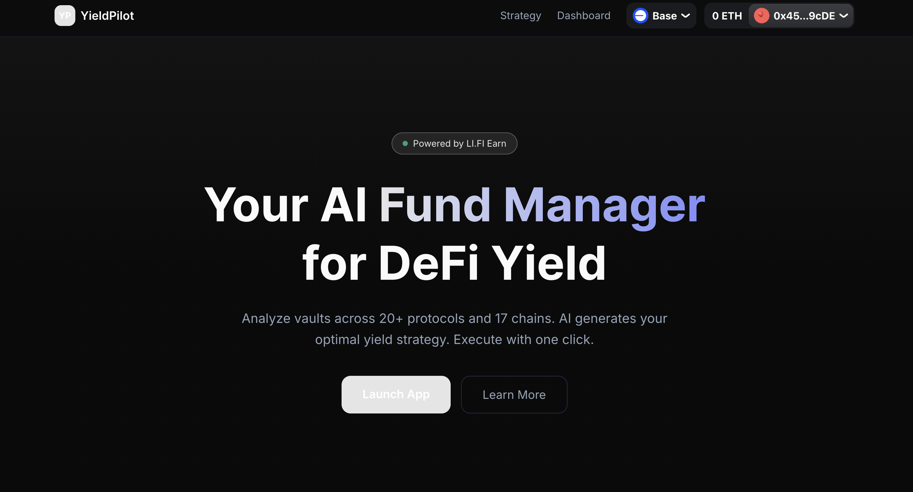

# YieldPilot — AI DeFi Fund Manager

> Your private AI fund manager for DeFi yield. Business in the front, yield in the back. Powered by [LI.FI](https://li.fi/) Earn.

**Live App:** https://yieldpilot-mu.vercel.app/

**Demo Video:** https://youtu.be/NRvkOinC0jg

**Hackathon:** DeFi Mullet Hackathon #1 | **Track:** AI x Earn

**Verified On-Chain:**
- [Test Wallet (Base)](https://basescan.org/address/0x4568b760c55FAEA0129139b863124f19962B9cDE) — `0x4568b760c55FAEA0129139b863124f19962B9cDE`

[](https://youtu.be/NRvkOinC0jg)

---

## Why YieldPilot

DeFi yield is fragmented. Users must manually compare APYs across 20+ protocols and 17 chains, assess risk for each vault, decide allocation percentages, and execute multiple transactions across different networks. YieldPilot automates this entire workflow with an AI strategy engine that analyzes, recommends, and executes — while giving users full transparency into every decision.

### Key Features

**AI Strategy Engine**
- Consumes real-time vault data from LI.FI Earn API (APY, TVL, protocol, tags, chain)
- Applies risk-based filtering rules (Conservative / Balanced / Aggressive)
- Generates diversified portfolio allocations with per-vault reasoning
- Every recommendation includes transparent AI analysis — no black box

**Strategy Comparison Mode**
- Generates all 3 risk profiles simultaneously in parallel
- Side-by-side comparison of APY, vault count, chain diversification, and risk scores
- Users select the best strategy with full context before executing

**One-Click Cross-Chain Execution**
- LI.FI Composer handles swap + bridge + deposit in a single transaction
- ERC-20 token approval + vault deposit in sequential steps
- Real-time execution progress with per-step status tracking
- Supports any-token to any-vault deposits across all supported chains

**Chain-Aware Intelligence**
- Detects user's current chain and prioritizes same-chain vaults
- Minimizes cross-chain fees by filtering vaults to the user's network
- Falls back to cross-chain options only when the preferred chain lacks quality vaults

**Portfolio Dashboard**
- Real-time position tracking via LI.FI Earn Portfolio API
- Portfolio value summary, active positions count, protocol diversification
- 30-day yield performance chart
- AI rebalancing suggestions when better opportunities appear

### Integration Depth

| Metric | Value |
|--------|-------|
| LI.FI Earn API endpoints used | **7 / 7** (100% coverage) |
| Vault universe analyzed | **672+** vaults |
| Supported chains | **17** (Base, Ethereum, Arbitrum, Optimism, Polygon, etc.) |
| Supported protocols | **11** (Morpho, Aave, Euler, Pendle, Ethena, etc.) |
| Risk profiles | **3** (Conservative, Balanced, Aggressive) |
| AI filtering dimensions | **5** (tags, TVL, protocol, diversification, APY trend) |

## Architecture

```
User <-> [Web UI: Landing + Strategy Engine + Dashboard]
              |
         [Next.js API Routes (server-side, protects API keys)]
         +--------+-----------+-----------+
         |        |           |           |
         v        v           v           v
    Earn Data   Composer    OpenAI     Portfolio
    API         API         API        API
    (no auth)   (API key)   (API key)  (no auth)
         |        |           |           |
         +--------+-----------+-----------+
              |
    [LI.FI Infrastructure]
    672+ vaults | 20+ protocols | 17 chains
```

### Data Flow

```
PHASE 1: DISCOVER
  Fetch all vaults with pagination (earn.li.fi/v1/earn/vaults)
  Fetch chains + protocols for metadata
  Scan user portfolio for existing positions

PHASE 2: ANALYZE
  Filter vaults by risk level (tags, TVL, protocol whitelist)
  Sort by APY preference (30d average for conservative, total for aggressive)
  Prioritize user's current chain to minimize fees
  Send top 50 candidates to AI for portfolio construction

PHASE 3: RECOMMEND
  AI generates structured allocation with:
  - Vault selection + percentage allocation (must sum to 100%)
  - Per-vault reasoning
  - Risk factors + warnings
  - Expected APY calculation

PHASE 4: EXECUTE
  For each allocation:
  1. Get quote from Composer (li.quest/v1/quote)
  2. Approve ERC-20 token spending
  3. Execute deposit transaction
  4. Track progress in real-time UI

PHASE 5: MONITOR
  Fetch positions via portfolio API
  Display in dashboard with yield charts
  Suggest rebalancing when better opportunities appear
```

## LI.FI Earn API Integration

YieldPilot uses **all 7 LI.FI Earn endpoints** across both services:

### Earn Data API (earn.li.fi — no auth required)

| Endpoint | Usage in YieldPilot |
|----------|-------------------|
| `GET /v1/earn/vaults` | Vault discovery with pagination (nextCursor), filtering by chainId. Fetches full vault universe for AI analysis. Cached 5 min server-side. |
| `GET /v1/earn/vaults/:network/:address` | Single vault detail for deep-dive information |
| `GET /v1/earn/chains` | Populates supported chain list for landing page stats. Cached 1 hour. |
| `GET /v1/earn/protocols` | Populates protocol count and metadata. Cached 1 hour. |
| `GET /v1/earn/portfolio/:addr/positions` | Fetches user's existing DeFi positions for asset scan and dashboard. Cached 1 min. |

### Composer API (li.quest — API key required)

| Endpoint | Usage in YieldPilot |
|----------|-------------------|
| `GET /v1/quote` (deposit) | Builds deposit transactions: fromToken (USDC) → toToken (vault address). Handles swap + bridge + deposit in one tx. |
| `GET /v1/quote` (redeem) | Builds withdrawal transactions for vault exits (vault token → underlying). |

### API Integration Details

- **Server-side proxying** — All API keys (Composer + OpenAI) stay in Next.js API routes, never exposed to the browser
- **Pagination handling** — Uses `nextCursor` to iterate through all 672+ vaults, capped at 500 for AI context window
- **Null-safe APY handling** — `apy7d` and `apy.reward` can be null; always uses fallback values
- **TVL string parsing** — `analytics.tvl.usd` is a string in the API; parsed to number for filtering and display
- **isTransactional check** — Only vaults with `isTransactional === true` are included in strategies

## AI Strategy Engine

The AI doesn't just sort by APY. It applies structured risk-based filtering before sending candidates to the LLM:

### Risk Profile Filtering Rules

| Dimension | Conservative | Balanced | Aggressive |
|-----------|-------------|----------|------------|
| Tags | Stablecoin only | Stablecoin + single | All |
| Min TVL | $10M+ | $1M+ | No limit |
| Protocols | Aave, Morpho, Spark | Mainstream | All |
| Min vaults | 3+ vaults, 2+ chains | 2+ vaults | Can concentrate |
| APY preference | Stability (30d avg) | Balanced | Highest total first |
| Chain preference | User's current chain | User's current chain | User's current chain |

### AI Output Structure

Every strategy includes:
- **Strategy name** — AI-generated descriptive name
- **Risk score** — 1-10 scale
- **Expected APY** — Weighted average across allocations
- **Per-vault allocation** — Percentage, amount, vault address, chain, protocol
- **Per-vault reasoning** — Why this vault was selected
- **Risk factors** — Positive diversification signals
- **Warnings** — Potential risk disclosures

### Transparency

The AI's reasoning is fully visible in the UI:
- "Why this vault" — each allocation has a human-readable explanation
- Risk factors panel — shows what makes the strategy safer
- Warnings panel — discloses any potential risks
- Users can review and adjust before executing

## Tech Stack

| Layer | Technology |
|-------|-----------|
| **Framework** | Next.js 14 (App Router, TypeScript) |
| **AI** | OpenAI GPT-4o-mini (strategy engine) |
| **DeFi Data** | LI.FI Earn Data API (earn.li.fi) |
| **DeFi Execution** | LI.FI Composer (li.quest) |
| **Wallet** | wagmi v2 + RainbowKit |
| **Styling** | Tailwind CSS + shadcn/ui |
| **Animation** | Framer Motion |
| **Charts** | Recharts |
| **Deploy** | Vercel |

## Pages

| Page | Route | Description |
|------|-------|-------------|
| **Landing** | `/` | Brand page with live stats (vault count, max APY, chains, protocols), hero CTA, feature cards |
| **Strategy Engine** | `/app` | Core 3-step flow: asset scan → risk select → AI strategy generation + comparison + execution |
| **Dashboard** | `/app/dashboard` | Portfolio overview, position cards, 30d yield chart, AI rebalancing suggestions |

## Getting Started

```bash
# Clone
git clone https://github.com/Louis-XWB/yieldpilot.git
cd yieldpilot

# Install
npm install

# Configure environment
cat > .env.local << 'EOF'
LIFI_COMPOSER_API_KEY=your_key_from_portal_li_fi
OPENAI_API_KEY=your_openai_api_key
OPENAI_BASE_URL=https://api.openai.com/v1
NEXT_PUBLIC_WALLETCONNECT_PROJECT_ID=your_walletconnect_project_id
EOF

# Run
npm run dev
```

Open http://localhost:3000

### Environment Variables

| Variable | Required | Source |
|----------|----------|--------|
| `LIFI_COMPOSER_API_KEY` | Yes | [LI.FI Partner Portal](https://portal.li.fi/) |
| `OPENAI_API_KEY` | Yes | [OpenAI](https://platform.openai.com/api-keys) or compatible proxy |
| `OPENAI_BASE_URL` | No | Defaults to `https://api.openai.com/v1`. Set for OpenAI-compatible proxies. |
| `NEXT_PUBLIC_WALLETCONNECT_PROJECT_ID` | Yes | [Reown (WalletConnect)](https://cloud.reown.com/) |

## Project Structure

```
src/
├── app/
│   ├── page.tsx                          # Landing page
│   ├── layout.tsx                        # Root layout with providers
│   ├── providers.tsx                     # Wagmi + RainbowKit + QueryClient
│   ├── app/
│   │   ├── page.tsx                      # Strategy Engine (core)
│   │   ├── layout.tsx                    # App layout with nav
│   │   └── dashboard/page.tsx            # Portfolio Dashboard
│   └── api/
│       ├── vaults/route.ts               # Earn Data API proxy
│       ├── chains/route.ts               # Earn Data API proxy
│       ├── protocols/route.ts            # Earn Data API proxy
│       ├── portfolio/[address]/route.ts  # Earn Data API proxy
│       ├── strategy/route.ts             # AI strategy generation
│       └── quote/route.ts               # Composer proxy (protects API key)
├── lib/
│   ├── types.ts                          # All TypeScript interfaces
│   ├── earn-api.ts                       # Earn Data API client
│   ├── ai-strategy.ts                    # AI strategy engine + risk filters
│   └── wagmi-config.ts                   # Wallet configuration
├── hooks/
│   └── use-portfolio.ts                  # Portfolio data hook
└── components/
    ├── landing/                          # Hero, stats ticker, feature cards
    ├── strategy/                         # Asset scan, risk selector, results, execution
    ├── dashboard/                        # Portfolio summary, positions, charts
    └── shared/                           # Nav, loading animation, connect prompt
```

## MCP Server (Model Context Protocol)

YieldPilot exposes its core capabilities as an MCP server, allowing any AI agent (Claude Code, Cursor, etc.) to discover vaults, generate strategies, and check portfolios programmatically.

### Available Tools

| Tool | Description | Auth Required |
|------|-------------|---------------|
| `discover_vaults` | Search and filter vaults by chain, APY, TVL, protocol, tags | None |
| `generate_strategy` | AI-powered yield strategy generation with risk profiling | `OPENAI_API_KEY` |
| `check_portfolio` | Check a wallet's DeFi yield positions | None |

### Setup

Add to your MCP client config (e.g., `~/.claude/mcp.json`):

```json
{
  "mcpServers": {
    "yieldpilot": {
      "command": "npx",
      "args": ["tsx", "src/mcp/server.ts"],
      "cwd": "/path/to/yieldpilot",
      "env": {
        "OPENAI_API_KEY": "your-openai-key"
      }
    }
  }
}
```

### Example Usage in Claude Code

```
> Use YieldPilot to find the top stablecoin vaults on Base with APY > 3%

> Generate a conservative yield strategy for $5000

> Check portfolio positions for 0x4568b760c55FAEA0129139b863124f19962B9cDE
```

### Run Standalone

```bash
npm run mcp
```

## Claude Code Skill

YieldPilot also ships as a Claude Code slash command. Add this repo to your project and use `/yieldpilot` to interact with DeFi yield data conversationally.

```
> /yieldpilot

What would you like to do?
1. Find vaults — search by chain, APY, TVL, protocol
2. Generate strategy — AI-powered yield allocation
3. Check portfolio — view wallet positions
4. Show chains / protocols
```

Example interactions:
```
> /yieldpilot find stablecoin vaults on Base with APY > 3%
> /yieldpilot generate a conservative strategy for $5000
> /yieldpilot check portfolio for 0x4568b760c55FAEA0129139b863124f19962B9cDE
```

## What's Next

- Auto-rebalancing execution (currently shows suggestions only)
- Historical performance tracking with database persistence
- Multi-wallet portfolio aggregation
- Mobile-responsive design
- Withdrawal flow via Composer redeem

## Team

Solo developer — [Novar](https://x.com/wab_hsu)

## License

MIT

---

Built for [DeFi Mullet Hackathon #1](https://lifi.notion.site/defi-mullet-hackathon-1-builder-edition) by [LI.FI](https://li.fi/)
